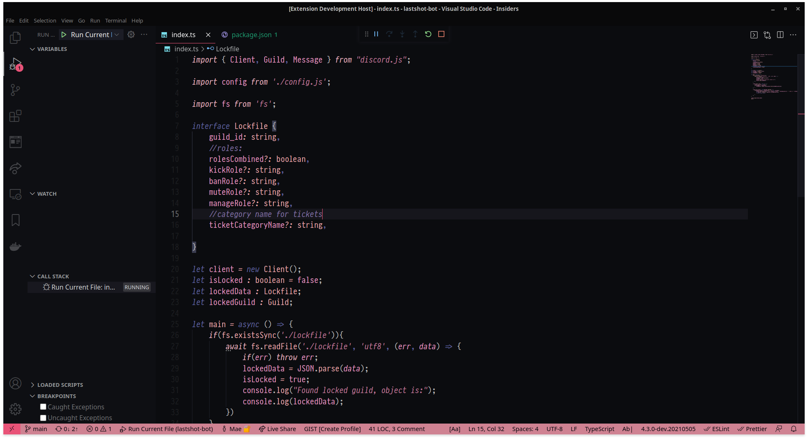

# Celestial
>VS Code theme for all the people who love to code in deep dark spaces, with customized colors.

## Preview

## Installation

1. Search for Celestial Mr in VS Code Extensions 
2. Click on Install to add the theme to your VS Code extensions
3. Open the Command Palette and select Preferences: Color Theme. This will list all themes you have installed.
4. Select the Celestial Mr theme to activate it.

## Credits

Celestial-mr is a modified version of [Celestial](https://github.com/apvarun/celestial-theme) by [apvarun](https://github.com/apvarun).
Celestial is a modified(darker) version of [Horizon](https://marketplace.visualstudio.com/items?itemName=jolaleye.horizon-theme-vscode) Theme by [Jonathon](https://marketplace.visualstudio.com/publishers/jolaleye).

## License

[MIT](LICENSE)
